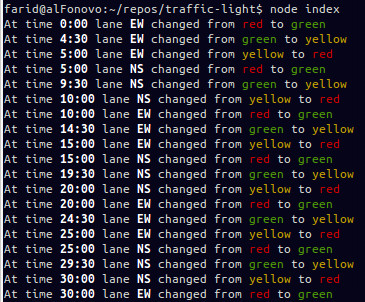

# Intersection Traffic Light Simulation

We have a simple intersection with two lanes, north-south and east-west. The lights should change
 from red to green every 5 minutes and should show the yellow light for 30 seconds.

## Example output

## How to run

First make sure you have node v7 or later as this project uses async functions.

Install with yarn or npm:

    npm install

And then just run index.js:

    node index

In case if you use node v7.5 or earlier, you need to use the `--harmony` flag:

    node --harmony index

By default it will not be in realtime and will just output everything at once and quit. You can
set the `--realtime` flag so that the lights change as time passes. If you find that too slow,
you can use the `--fast` which will be about 200 times faster!

    node index --realtime --fast

### Tests

Run `npm test`.

## Why

This project was written to show off what I can in a few hours.

## Tell me a little bit more

Although the requirements were simple, the library(lib/intersection.js) was written with the fact
 that it could be extended in the future or to be run with more than 2 lanes